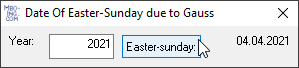

# Date_EasterGauss
## Calculates the date of easter-sunday due to Gauss  

 

Project started in nov 2010  

09.jun.2023: 
The function [OsternShort2](https://github.com/OlimilO1402/Date_TimeConversion/blob/main/Modules/MTime.bas#L1078) is now part of the module [MTime](https://github.com/OlimilO1402/Date_TimeConversion/blob/main/Modules/MTime.bas) which can be found in the repo [Date_TimeConversion](https://github.com/OlimilO1402/Date_TimeConversion)

